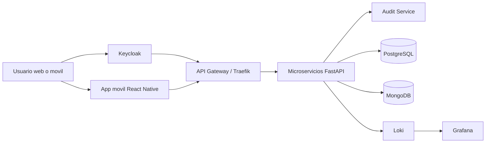
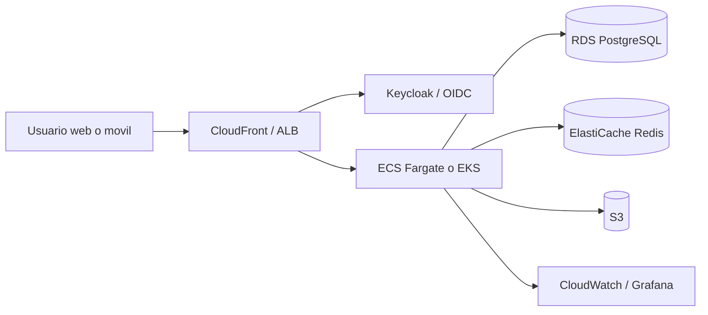

# TelcoX - Arquitectura Aplicada, On-Premise y AWS

## Resumen

Este documento consolida lo que ya fue aplicado en el proyecto TelcoX y como se organiza la arquitectura actual en una maquina virtual on-premise, junto con una propuesta equivalente en AWS.

La solucion esta basada en microservicios FastAPI, frontend web en Next.js, una app movil en Expo/React Native, autenticacion OIDC con Keycloak, auditoria centralizada, observabilidad con Loki/Grafana/Promtail y despliegue Kubernetes con Helm.

## Lo Aplicado En El Proyecto

### Frontend Web

- Login OIDC con Keycloak usando Authorization Code Flow con PKCE.
- Bloqueo del dashboard hasta completar onboarding.
- `OnboardingGate` como barrera de entrada antes del panel principal.
- Flujo de onboarding con verificacion de identidad y habilitacion de metodos de acceso.

### Frontend Movil

- App Expo/React Native en `mobile/`.
- Pantalla de login conectada al mismo flujo OIDC.
- Pantalla principal de onboarding con verificacion de identidad y habilitacion de acceso.
- React Native se eligio porque permite reutilizar logica compartida de autenticacion, validacion, contratos de API y flujo de onboarding entre web y movil, sin compartir componentes visuales. Eso reduce duplicacion y mantiene independencia de UI por plataforma.

### Microservicios

- `customer_service`
- `catalog_service`
- `service_status_service`
- `provisioning_service`
- `billing_service`
- `payment_service`
- `notification_service`
- `onboarding_service`
- `audit_service`
- servicios externos simulados para KYC, OSS, pagos y notificaciones

### Seguridad Y Autenticacion

- Keycloak como proveedor de identidad.
- PKCE para web y movil.
- Tokens de vida corta con refresco.
- Bloqueo de acceso al portal si el onboarding no esta verificado.
- Certificados SSL/TLS aplicados en las comunicaciones expuestas por Ingress, gateway y frontend.
- Cifrado en base de datos para proteger informacion sensible en reposo.
- Politica de seguridad de datos aplicable desde el inicio del sistema, incluyendo clasificacion, retencion, consentimiento y minimizacion de datos.

### Auditoria

- Registro de acciones por usuario en `customer_service` y `onboarding_service`.
- Servicio dedicado `audit_service`.
- Persistencia de auditoria en memoria para desarrollo y opcion de PostgreSQL para escenarios persistentes.
- Preparacion para observabilidad de eventos con logs estructurados.

### Persistencia Y Consultas Frecuentes

- Propuesta de patron `Cache-Aside` para lecturas frecuentes.
- Patron `Repository` para desacoplar acceso a datos.
- Alternativa de cache distribuida con Redis.
- Separacion entre auditoria transaccional y observabilidad.

### Infraestructura

- Helm charts por microservicio.
- Helm charts propios para PostgreSQL y MongoDB en Kubernetes.
- Helm para observabilidad con Grafana, Loki y Promtail.
- Helm para Keycloak.
- WAF de Cloudflare aplicado al dominio publico del sistema.
- Despliegues CI/CD con GitHub Actions para microservicios, UI y observabilidad.
- Dockerfiles mas livianos con imagenes `slim` y `alpine` donde aplica.
- Contenedores no-root para los servicios Python.
- `uvicorn` limitado a un solo worker por contenedor.
- Requests y limits ajustados para poder convivir en una maquina pequena.

## Arquitectura On-Premise

La arquitectura on-premise actual esta pensada para correr sobre una maquina virtual o un cluster Kubernetes pequeno, con exposicion publica via Traefik o Cloudflare Tunnel si existe CGNAT.

### Diagrama General

### Componentes

- **UI web**: Next.js
- **UI movil**: Expo / React Native
- **Gateway de entrada**: Traefik
- **Identidad**: Keycloak
- **Servicios de negocio**: microservicios FastAPI
- **Auditoria**: servicio dedicado + logs centralizados
- **Bases de datos**: PostgreSQL y MongoDB en Kubernetes
- **Observabilidad**: Grafana + Loki + Promtail
- **Exposicion externa alternativa**: Cloudflare Tunnel
- **Servicios externos simulados**: namespace independiente `external-sim` para KYC, OSS, pago, notificaciones y SRI.

### Caracteristicas Operativas

- Rolling updates.
- Liveness/readiness probes con delays para evitar reinicios prematuros.
- Auto-healing por Kubernetes.
- Tolerancia a fallos por replica unica controlada, con reinicio automatico de pods.
- Logs centralizados para diagnostico.
- Separacion por charts y releases para cada componente.

### Consideraciones De On-Premise

- Adecuado para un laboratorio, demo o entorno de despliegue inicial.
- El punto mas sensible es la disponibilidad del nodo unico.
- Si la VM cae, la recuperacion depende de backups y de la capacidad de reconstruccion del entorno.
- Para alta disponibilidad real, habria que pasar a un cluster con varios nodos.
- El despliegue actual corre sobre un servidor con 3 CPU y 4 GB de RAM, por lo que los recursos fueron ajustados para operar dentro de ese presupuesto.

## Arquitectura Objetivo En AWS

La version en AWS debe conservar la modularidad actual, pero usando servicios gestionados para reducir carga operativa.

### Propuesta Base

- **Frontend web**: S3 + CloudFront, o ECS/App Runner si se necesita SSR.
- **Frontend movil**: distribucion nativa iOS/Android, consumiendo la misma API.
- **Microservicios**: ECS Fargate o EKS.
- **Base transaccional**: RDS PostgreSQL.
- **Cache**: ElastiCache Redis.
- **Auditoria y logs**: CloudWatch Logs, con opcion de Grafana administrado.
- **Almacenamiento de archivos**: S3.
- **Seguridad**: IAM, Secrets Manager, WAF, ACM.
- **Balanceo**: ALB.

### Diagrama AWS

### Alta Disponibilidad En AWS

- Despliegue multi-AZ.
- RDS Multi-AZ.
- Auto Scaling para microservicios.
- Health checks en ALB.
- Reinicio automatico de tareas fallidas.
- Backups automaticos y snapshots.
- IaC con Terraform o AWS CDK.

### Recuperacion Ante Desastres

- Backups programados de bases de datos.
- Versionado de imagenes en ECR.
- Infraestructura reproducible con IaC.
- Runbooks de recuperacion.
- Exportacion de logs y metricas.

## Cumplimiento Normativo

Para telecom y datos sensibles, esta solucion debe considerar:

- Ley local de proteccion de datos del pais de operacion.
- GDPR si hay tratamiento de datos de usuarios de la Union Europea.
- PCI DSS si hay pagos con tarjeta.
- Normativa especifica de seguridad de comunicaciones aplicable al sector telecom.
- SSL/TLS en transito.
- Cifrado en reposo.
- Retencion y eliminacion segura de datos.
- Consentimiento explicito para biometria y documentos.
- Trazabilidad de acciones y accesos privilegiados.

## Recomendacion De Diseno

- Mantener los microservicios desacoplados.
- No compartir modulos `shared` entre servicios.
- Reutilizar contratos, no logica de dominio.
- Usar patrones `Repository`, `Strategy` y `Cache-Aside`.
- Tratar la auditoria como un flujo separado de la observabilidad.

## Estado De Entrega

La solucion ya incorpora:

- login web con Keycloak
- bloqueo de dashboard hasta verificar onboarding
- onboarding web funcional
- app movil base con login y onboarding
- infraestructura de bases de datos en Kubernetes
- observabilidad con Loki/Grafana/Promtail
- ajustes de imagenes y recursos para un entorno de recursos limitados

## Conclusion

La arquitectura actual es adecuada como plataforma on-premise sobre una VM o cluster pequeno. Para AWS, la misma solucion puede evolucionar a una plataforma gestionada con ECS Fargate, RDS, CloudFront, CloudWatch y Secrets Manager, manteniendo el desacoplamiento y mejorando disponibilidad, escalabilidad y resiliencia.

## Glosario De Siglas

- `PKCE`: Proof Key for Code Exchange. Extension del flujo OAuth 2.0 para proteger clientes publicos.
- `OIDC`: OpenID Connect. Capa de autenticacion construida sobre OAuth 2.0.
- `OAuth 2.0`: Protocolo de autorizacion para conceder acceso a recursos sin compartir contrasenas.
- `TLS`: Transport Layer Security. Protocolo de cifrado en transito.
- `SSL`: Secure Sockets Layer. Nombre historico usado comunmente para referirse a TLS.
- `KYC`: Know Your Customer. Verificacion de identidad y riesgo del usuario.
- `BSS`: Business Support Systems. Sistemas de soporte al negocio en telecom.
- `OSS`: Operations Support Systems. Sistemas de soporte operativo en telecom.
- `SRI`: Servicio de Rentas Internas. En este proyecto, referencia a validacion fiscal.
- `MFA`: Multi-Factor Authentication. Autenticacion multifactor.
- `SSR`: Server-Side Rendering. Renderizado en servidor.
- `CQRS`: Command Query Responsibility Segregation. Separacion de comandos y consultas.
- `DR`: Disaster Recovery. Recuperacion ante desastres.
- `HA`: High Availability. Alta disponibilidad.
- `WAF`: Web Application Firewall. Firewall de aplicaciones web.
- `IAM`: Identity and Access Management. Gestion de identidades y permisos.
- `ALB`: Application Load Balancer. Balanceador de aplicaciones de AWS.
- `ECS`: Elastic Container Service. Orquestacion de contenedores en AWS.
- `EKS`: Elastic Kubernetes Service. Kubernetes administrado en AWS.
- `RDS`: Relational Database Service. Base de datos relacional administrada por AWS.
- `ECR`: Elastic Container Registry. Registro de imagenes de AWS.
- `S3`: Simple Storage Service. Almacenamiento de objetos de AWS.
- `SNS`: Simple Notification Service. Servicio de notificaciones de AWS.
- `SQS`: Simple Queue Service. Servicio de colas de AWS.
