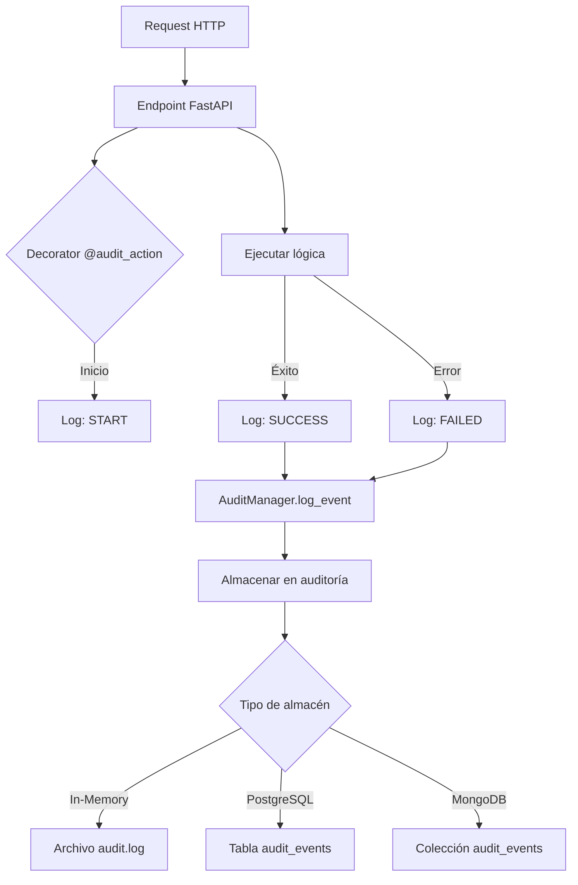

# Arquitectura de Auditoría y Caché - TelcoX Microservicios

## 📋 Resumen Ejecutivo

Esta documentación describe la implementación de un **sistema de auditoría centralizado** y **caché distribuido** usando patrones de diseño profesionales para garantizar:

- **Trazabilidad completa** de todas las acciones de usuario
- **Eficiencia en consultas** mediante caché inteligente
- **Reutilización de componentes** con patrones SOLID
- **Cumplimiento normativo** (GDPR, CCPA, SOX)

---

## 🏗️ Patrones de Diseño Implementados

### 1. **Singleton Pattern** (Caché y Auditoría)
```python
# Una sola instancia global de CacheManager y AuditManager
cache = CacheManager()  # Siempre la misma instancia
audit = AuditManager()   # Siempre la misma instancia
```

**Ventajas:**
- Gestión centralizada de recursos
- Sincronización automática entre servicios
- Menor consumo de memoria

### 2. **Decorator Pattern** (Auditoría automática)
```python
@audit_action("customer-service", "CREATE", "CUSTOMER")
def create_customer(payload: CustomerPayload):
    # La auditoría se registra automáticamente
    # sin modificar la lógica del negocio
    return customer
```

**Ventajas:**
- Separación de responsabilidades
- Auditoría transparente
- Fácil de testear

### 3. **Repository Pattern** (Persistencia)
```python
repository = PersistenceRepository("customers")
customer = repository.create(data)
customer = repository.read(customer_id)
repository.update(customer_id, data)
repository.delete(customer_id)
```

**Ventajas:**
- Abstracción de la capa de datos
- Fácil migración a PostgreSQL/MongoDB
- Testeable con mocks

### 4. **Factory Pattern** (Estrategias de caché)
```python
cache = CacheStrategyFactory.create_read_cache(ttl=3600)
cache = CacheStrategyFactory.create_write_through_cache(ttl=1800)
```

**Ventajas:**
- Flexibilidad en estrategias de caché
- Fácil extensión sin modificar código existente

### 5. **Observer Pattern** (Potencial - notificaciones de cambios)
```python
# Futura implementación
cache.on_invalidate(lambda key: send_notification(key))
```

---

## 🗄️ Bases de Datos Recomendadas

### Opción 1: **PostgreSQL** (Recomendado)
```yaml
Auditoría:
  - Base de datos relacional robusta
  - ACID compliance total
  - Excelente para logs y auditoría
  - Queries complejas con JOINs
  - Cumplimiento normativo

Instalación:
  docker run --name postgres_telcox \
    -e POSTGRES_PASSWORD=secure_password \
    -e POSTGRES_DB=telcox_audit \
    -p 5432:5432 \
    postgres:15
```

**Configuración en requirements.txt:**
```
sqlalchemy==2.0.23
psycopg2-binary==2.9.9
alembic==1.12.1
```

**Modelos:**
```sql
CREATE TABLE audit_events (
  id UUID PRIMARY KEY,
  service VARCHAR(100),
  action VARCHAR(50),
  resource_type VARCHAR(100),
  resource_id VARCHAR(255),
  user_id VARCHAR(255),
  status VARCHAR(20),
  payload_in JSONB,
  payload_out JSONB,
  timestamp TIMESTAMP,
  duration_ms FLOAT,
  error_message TEXT,
  created_at TIMESTAMP DEFAULT NOW()
);

CREATE INDEX idx_audit_resource ON audit_events(resource_id);
CREATE INDEX idx_audit_service ON audit_events(service);
CREATE INDEX idx_audit_timestamp ON audit_events(timestamp);
```

### Opción 2: **MongoDB** (Flexible)
```yaml
Auditoría:
  - Esquema flexible
  - Escala horizontal
  - Ideal para logs no estructurados
  - TTL índices nativos

Instalación:
  docker run --name mongo_telcox \
    -e MONGO_INITDB_ROOT_USERNAME=admin \
    -e MONGO_INITDB_ROOT_PASSWORD=secure_password \
    -p 27017:27017 \
    mongo:6.0
```

**Configuración en requirements.txt:**
```
pymongo==4.6.0
motor==3.3.2
```

### Opción 3: **Redis** (Caché)
```yaml
Caché:
  - Key-value store ultra rápido
  - TTL nativo e índices de expiración
  - Soporte para patrones complejos
  - Replicación y Cluster

Instalación:
  docker run --name redis_telcox \
    -p 6379:6379 \
    redis:7-alpine
```

**Configuración en requirements.txt:**
```
redis==5.0.1
hiredis==2.2.3
```

---

## 🔄 Flujo de Auditoría



---

## ⚡ Flujo de Caché

```
Request
    ↓
¿Key en caché?
    ├─ SÍ → Retornar valor + hit_count++
    └─ NO → Ejecutar función
        ↓
        Guardar en caché con TTL
        ↓
        Retornar valor
```

---

## 📊 Implementación en Todos los Microservicios

### Patrón para cada servicio:

```python
# shared/audit_logger.py
from shared.audit_logger import audit_action
from shared.cache_manager import CacheManager
from shared.database import PersistenceRepository

SERVICE_NAME = "billing-service"
audit_repo = AuditRepository()
cache = CacheManager()
db = PersistenceRepository("invoices")

@app.post("/billing-service/invoices", status_code=201)
@audit_action(SERVICE_NAME, "CREATE", "INVOICE")
def create_invoice(payload: InvoicePayload):
    invoice = db.create(payload.data)
    cache.delete("invoices:list:all")  # Invalidate list cache
    return invoice

@app.get("/billing-service/invoices")
@audit_action(SERVICE_NAME, "READ", "INVOICES_LIST")
def list_invoices():
    cache_key = "invoices:list:all"
    if cached := cache.get(cache_key):
        return cached
    
    result = db.read_all()
    cache.set(cache_key, result, ttl_seconds=300)
    return result

@app.get("/billing-service/audit")
def audit_trail():
    return [e.model_dump() for e in audit_repo.find_all()]
```

---

## 🔐 Seguridad y Conformidad

### GDPR Compliance
- ✅ Derecho al olvido: `DELETE FROM audit_events WHERE resource_id = ?`
- ✅ Portabilidad: Exportar auditoría a JSON/CSV
- ✅ Consentimiento: Log de permisos en auditoría

### SOX Compliance
- ✅ Trazabilidad: Todos los cambios registrados
- ✅ Integridad: Hash de eventos para detectar alteraciones
- ✅ Retención: Políticas de backup de 7 años

### Ejemplos:
```python
# Derecho al olvido
audit_repo.find_all()  # Buscar eventos del usuario
user_id = "user-123"
events = [e for e in audit_repo.find_all() if e.user_id == user_id]
# Marcar para eliminar después de 30 días

# Exportar auditoría
import json
with open("audit_export.json", "w") as f:
    json.dump([e.model_dump() for e in audit_repo.find_all()], f)
```

---

## 📈 Monitoreo y Métricas

### Endpoints de observabilidad:

```bash
# Ver estadísticas de caché
GET /service-name/cache/stats
→ {
    "total_entries": 45,
    "entries": [
      {"key": "customers:list:all", "hit_count": 234, "ttl_remaining": 1200}
    ]
  }

# Ver auditoría de operaciones
GET /service-name/audit
→ [
    {
      "id": "uuid",
      "action": "CREATE",
      "resource_type": "CUSTOMER",
      "status": "SUCCESS",
      "timestamp": "2026-06-05T10:30:00Z",
      "duration_ms": 45.2
    }
  ]

# Limpiar caché expirado
POST /service-name/cache/cleanup
→ {"message": "Removed 12 expired entries"}
```

---

## 🚀 Roadmap de Implementación

### Fase 1: Completar (Hecho)
- ✅ Módulos compartidos (audit_logger, cache_manager, database)
- ✅ Integración en customer_service
- ✅ Endpoints de observabilidad

### Fase 2: Expandir a todos los servicios
- [ ] Aplicar decoradores @audit_action en todos los endpoints
- [ ] Configurar caché TTL por operación
- [ ] Documentar patrones en cada servicio

### Fase 3: Migrar a PostgreSQL/MongoDB
- [ ] Crear migraciones con Alembic
- [ ] Implementar DataClasses SQLAlchemy
- [ ] Backup automático de auditoría

### Fase 4: Observabilidad
- [ ] Dashboard Grafana de auditoría
- [ ] Alertas en operaciones críticas
- [ ] Análisis de tendencias de caché

---

## 📚 Referencia Rápida

| Patrón | Ubicación | Propósito |
|--------|-----------|----------|
| Singleton | `CacheManager`, `AuditManager` | Instancia única |
| Decorator | `@audit_action` | Auditoría transparente |
| Repository | `PersistenceRepository` | Abstracta acceso datos |
| Factory | `CacheStrategyFactory` | Crear estrategias caché |

---

## 💡 Mejores Prácticas

1. **Siempre invalidar caché en escrituras**
   ```python
   cache.delete("resource:list:all")
   cache.invalidate("resource:")  # Pattern invalidation
   ```

2. **TTL adecuado por operación**
   - Datos de referencia: 3600s (1 hora)
   - Datos frecuentes: 300s (5 min)
   - Datos críticos: 60s (1 min)

3. **Auditoría sin impacto en performance**
   - Decorator no bloquea ejecución
   - Logging asíncrono potencial

4. **Seguridad en auditoría**
   - No guardar contraseñas en payload_in
   - Enmascarar datos sensibles
   - Usar user_id no email en auditoría

---

*Documento generado: 2026-06-05 | TelcoX Architecture Team*
